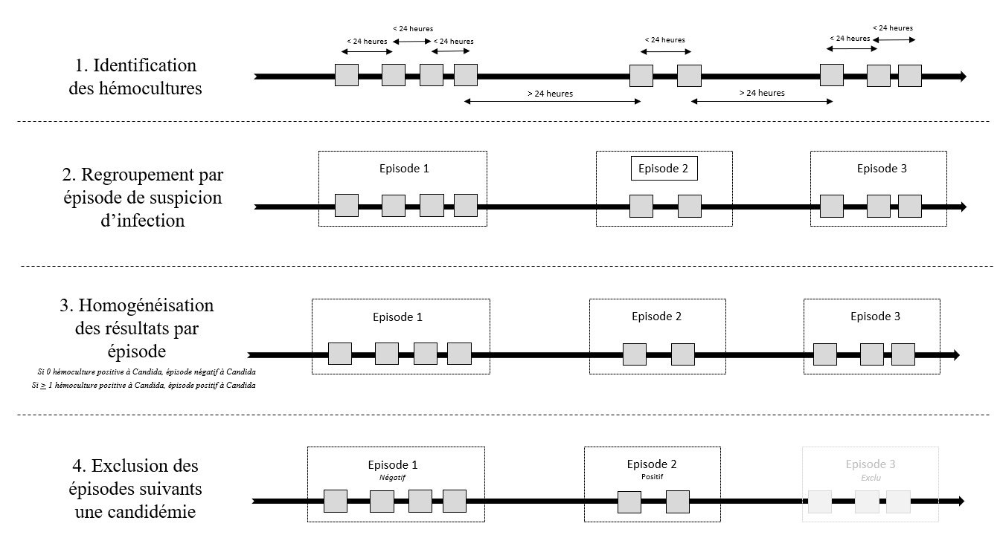
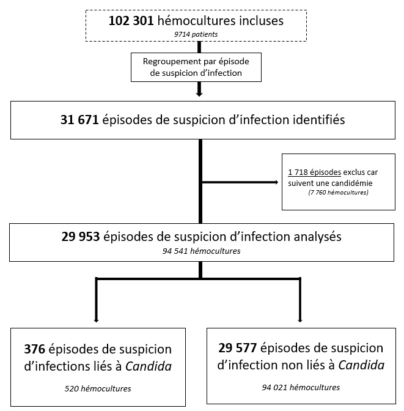

------------------------------------------------------------------------

# [**Stratification du risque de candidémie en soins intensifs/réanimation**]{.underline}

## [Introduction]{.underline}

*Candida* est une levure saprophyte du revêtement cutané et de la muqueuse oro-digestive chez l’être humain. Ces champignons peuvent provoquer des infections sanguines (candidémies) et des atteintes de tissus profonds (candidoses invasives), représentant la pathologie fongique nosocomiale la plus fréquente dans les pays occidentaux (1).

Les candidémies sont particulièrement fréquentes chez les patients hospitalisés en réanimation, représentant 8% des hémocultures positives et 15% des infections nosocomiales dans ces services (2). Les patients de réanimation en présentent en effet de nombreux facteurs de risque : certains dispositifs invasifs tels que les cathéters veineux centraux, les cathéters de dialyse, ou la ventilation mécanique, qui sont des outils thérapeutiques employés quasi-exclusivement en réanimation ; la nutrition parentérale, administrée uniquement par ces cathéters profonds ; les chirurgies abdominales lourdes ou les pancréatites aigues nécrosantes. Par ailleurs, une hospitalisation prolongée, associée à une exposition répétée aux antibiotiques, favorisent la colonisation à *Candida*, première étape vers l’infection invasive (4,5).

Les dernières décennies ont été marquées par une incidence croissante des candidoses invasives en réanimation, sans amélioration significative de leur pronostic (6,7). Leur pronostic est dépendant de la précocité d’initiation du traitement antifongique (8,9). Or le diagnostic des candidoses invasives repose sur les hémocultures, dont la sensibilité est imparfaite (10) et le délai de pousse tardif, ce qui impacte négativement le pronostic des patients (11).

Pour pallier ces limites, les cliniciens s’appuient sur les facteurs de risque et des biomarqueurs, tels que les β-D-glucanes, pour identifier les patients à risque et introduire précocement un traitement antifongique. Ces stratégies empiriques ou préemptives entraînent toutefois une surutilisation des antifongiques sans bénéfice démontré sur la survie des patients (12). Des scores prédictifs ont été développés à partir de critères cliniques et, dans certains cas, des variables biologiques, afin de dichotomiser les patients en populations haut risque/bas risque (13-15). Cependant, devant des populations de patients hospitalisés en réanimation changeantes, l'évolution des pratiques médicales, le développement de nouveaux outils diagnostiques tel que la PCR, nous proposons une division du risque en 3 catégories :

- Une population à bas risque, permettant d'éliminer l'hypothèse d'une candidémie

- -Une population à risque intermédiaire, auprès de laquelle les marqueurs fongiques ou les nouvelles méthodes de biologie moléculaire sont à proposer

- Une population à haut risque (\> 20%) chez qui il semble licite de proposer un traitement antifongique empirique d'emblée.

## [Méthodes]{.underline}

### Source des données

Il s'agit d'une étude observationnelle monocentrique rétrospective, utilisant les données des patients hospitalisés en soins intensifs et réanimation au CHU de Lille depuis 2013, contenues dans l’entrepôt de données de santé *Include* du CHU de Lille. Celui-ci intègre différentes sources informatisées de données recueillies dans le cadre d’une prise en charge au CHU de Lille, notamment le système de gestion des données de réanimation ICCA (Philips), le système d’information de laboratoire MOLIS (CompuGroupMedical) et le logiciel CORA PMSI pour le codage des diagnostics et des actes CCAM.

L'extraction des données a été réalisée par les ingénieures data d'*Include* (Mme Charlotte GEAY, Mme Léa GRUMIAUX et Mme Marie Amélie RISPAL). La structuration des données, la comparaison des données, les analyses statistiques ont été réalisées sur le logiciel R, version 4.6.0.

### Population

La population éligible est la suivante :

- Patients hospitalisés en réanimation ou en surveillance continue au CHU de Lille (hôpitaux Huriez, Institut Cœur Poumon & Salengro, hors service de réanimation neurochirurgicale) depuis plus de 48 heures,

- Ayant été prélevés d’au moins une hémoculture (plusieurs hémocultures peuvent être prélevées chez un même patient durant son séjour en réanimation).

### Critère de jugement principal

L'objectif de notre modélisation est la stratitification du risque de candidémie inaugurale acquise en soins intensifs/réanimation. Afin d'être au plus proche de la réflexion du clinicien, nous procédons à un regroupement des hémocultures par épisode de suspicion d'infection. En effet, lors d'une suspicion d'infection, plusieurs hémocultures sont prélevées à des temporalités proches, afin d'identifier au mieux l'agent infectieux responsable. Les hémocultures sont donc regroupées par épisode de suspicion d'infection, jusqu'à ce que la dernière hémoculture prélevée pour un même patient soit séparée d'un délai strictement supérieur à 24 heures de la prochaine hémoculture. Une fois les hémocultures regroupées, si l'une des hémocultures d'un groupe était positive à *Candida*, nous considérions toutes les hémocultures de ce groupe comme positives à *Candida*. Enfin, seules les données de la première hémoculture du groupe étaient gardées, afin de placer notre modélisation à la phase la plus initiale de l'épisode de suspicion d'infection.

L'objectif étant d'identifier une candidémie inaugurale, toutes les hémocultures suivants une hémoculture positive à *Candida* sont supprimées.



### Variables et feature Extraction

Les données démographiques sont récoltées à l'admission et considérées comme inchangées au décours. Ces données portaient sur le lieu d'hospitalisation, l'âge à l'admission, les antécédents de maladie hématologique maligne, de transplantation d'organe solide, de diabète, de pancréatite aigue, et de tumeurs d'organes solides.

Les données cliniques et biologiques reflétants l'état à l'admission du patient du patient sont extraites dans les 24 heures suivant l'horaire d'admission en soins intensifs, ainsi que dans les 24 heures précédant la réalisation de l'hémoculture : score IGS2, score SOFA, poids, températures minimale et maximale, diurèse totale et normalisée, exposition à des amines (adrénaline, noradrénaline, terlipressine, dobutamine) était identifiée, la présence d'une ventilation invasive, la présence d'une épuration extra-rénale, ainsi que la présence d'un remplissage vasculaire. Les valeurs maximales de créatinémie, lactatémie et urémie étaient récoltées ; les valeurs minimales de leucocytémie et de rapport PaO2/FiO2. La présence d'un état de choc était définie par la présence d'amines, d'une lactatémie \> 4 mmol/L ou d'un score SOFA cardiovasculaire \>{.underline} à 3.

Afin de quantifier les exposisions antérieures en réanimation, la présence de fibroscopie(s) digestive(s), de chirurgie(s) abdominale(s), de chirurgie(s) majeures, les durées de ventilation mécanique invasive, de nutrition parentérale, les durées de présence de cathéters (artériels, veineux centraux, de dialyse, ou d'ECMO), la durée d'exposition aux antibiotiques, aux immunosuppresseurs ou aux corticoïdes, et le nombre de culots globulaires, plaquettaires & poches de plasma étaient également récoltées. Les durées de neutrophilie (définie comme \> 7 G/L), neutropénie (définie comme \< 0,5 G/L) et de lymphopénie (définie comme lymphocytes \< 0.1 G/L) étaient identifiées.

### Analyses statistiques

Les variables catégorielles sont décrites en effectifs & pourcentage. Les variables continues sont présentées par médiane, minimale et maximale. Une description démographique & univariée est réalisée dans un premier temps.Sont réalisées dans un second temps des analyses bivariées afin de de décrire le lien entre la présence d'une candidémie & les variables extraites. Les variables pertinentes cliniquement, constantes avec la littérature, ou en faveur d'un sur-risque de candidémie lors de l'analyse bivariée ont été incluses dans une analyse multivariée. L'analyse multivariée sera réalisée via régression logistique mixte avec effet aléatoire via le patient.

### Données manquantes

Après extraction, certaines données n'ont pu être retrouvées, faute d'analyse ou de réalisation de l'examen. Un tableau récapitulatif des données manquantes est présenté ci-dessous. Des imputations multiples sont réalisées pour les données manquantes considérées *Missing at Random.*

### Cadre réglementaire

La conformité au Règlement Général sur la Protection des Données (RGPD) du traitement de ces données par le CHU de Lille sur le fondement de l’intérêt public à des fins de recherche a été validée par la Commission Nationale de l’Informatique et des Libertés (CNIL) (Délibération n°2019-103). Les responsables d’Include ont pris toutes les mesures pour mener les futurs projets de recherche conformément à la loi française et européenne.

## [Résultats]{.underline}

### Flowchart

Après extraction des hémocultures de l'entrepôt de données de santé, nous procédons à une analyse exploratoire des données. Nous identifions donc **104 620** hémocultures, avec **9813 séjours**, chez **9714** individus (\@fig_flow_chart). A noter qu'en moyenne, chaque individu se voyait prélever [2 hémocultures par séjour]{.underline}.



### Description de la population

Dans notre population d'étude, les patients étaient majoritairement de sexe masculin (66%), et d'âge médian de 61 ans. 4.7% présentaient des antécédents de maladie hématologique maligne, 26% de diabète, et 18% de tumeurs solides. A l'admission, 84% présentaient un état de choc et 67 % étaient ventilés de manière invasive. L'ensemble de la description est représentée dans le tableau 1.

```{r}
#| label: tbl_demographique
#| message: false
#| warning: false
#| tbl-cap: Tableau 1 - Description démographique de la population
#| lightbox: true
source("scripts/brutes/_setup.R")
source("scripts/brutes/tbl1_demo.R")

tbl1_gt <- tbl1 |>
  as_gt()
tbl1_gt
```

<!--  -->

#### Analyse bivariée

<!--  -->

Nous réalisons une comparaison bi-variées, avec correction du risque d'inflation du risque alpha via la méthode de *false detection rate (FDR)*.

```{r}
#| label: tbl_bv
#| tbl-cap: Tableau 2 - Analyse bivariée de la survenue d'une candidémie
#| lightbox: true
source("scripts/brutes/tbl2_bv.R")

tbl2_gt <- tbl2 |>
  as_gt()

tbl2_gt
```

#### Modélisation

AJOUTER la suite xxxxxx

## Bibliographie

1.      Arendrup MC, Sulim S, Holm A, Nielsen L, Nielsen SD, Knudsen JD, et al. Diagnostic Issues, Clinical Characteristics, and Outcomes for Patients with Fungemia. J Clin Microbiol. sept 2011;49(9):3300‑8. 

2.      Paiva JA, Pereira JM, Tabah A, Mikstacki A, De Carvalho FB, Koulenti D, et al. Characteristics and risk factors for 28-day mortality of hospital acquired fungemias in ICUs: data from the EUROBACT study. Crit Care. 9 mars 2016;20(1):53. 

3.      Arendrup MC. Epidemiology of invasive candidiasis: Current Opinion in Critical Care. oct 2010;16(5):445‑52. 

4.      Vincent JL. International Study of the Prevalence and Outcomes of Infection in Intensive Care Units. JAMA. 2 déc 2009;302(21):2323. 

5.      The French Mycosis Study Group, Lortholary O, Renaudat C, Sitbon K, Madec Y, Denoeud-Ndam L, et al. Worrisome trends in incidence and mortality of candidemia in intensive care units (Paris area, 2002–2010). Intensive Care Med. sept 2014;40(9):1303‑12 

6.      Lamoth F, Lockhart SR, Berkow EL, Calandra T. Changes in the epidemiological landscape of invasive candidiasis. Journal of Antimicrobial Chemotherapy. 1 janv 2018;73(suppl_1):i4‑13. 

7.      Cleveland AA, Farley MM, Harrison LH, Stein B, Hollick R, Lockhart SR, et al. Changes in Incidence and Antifungal Drug Resistance in Candidemia: Results From Population-Based Laboratory Surveillance in Atlanta and Baltimore, 2008-2011. Clinical Infectious Diseases. 15 nov 2012;55(10):1352‑61. 

8.      Kollef M, Micek S, Hampton N, Doherty JA, Kumar A. Septic Shock Attributed to Candida Infection: Importance of Empiric Therapy and Source Control. Clinical Infectious Diseases. 15 juin 2012;54(12):1739‑46. 

9.      Guinea J. Global trends in the distribution of Candida species causing candidemia. Clinical Microbiology and Infection. juin 2014;20:510. 

10.  Garey KW, Rege M, Pai MP, Mingo DE, Suda KJ, Turpin RS, et al. Time to Initiation of Fluconazole Therapy Impacts Mortality in Patients with Candidemia: A Multi-Institutional Study. 

11.  Timsit JF, Azoulay E, Schwebel C, Charles PE, Cornet M, Souweine B, et al. Empirical Micafungin Treatment and Survival Without Invasive Fungal Infection in Adults With ICU-Acquired Sepsis, *Candida* Colonization, and Multiple Organ Failure: The EMPIRICUS Randomized Clinical Trial. JAMA. 18 oct 2016;316(15):1555.

**\_\_\_\_\_\_\_\_\_\_\_\_\_\_\_\_\_\_\_\_\_\_\_\_\_\_\_\_\_\_\_\_\_\_\_\_\_\_\_\_\_\_\_\_\_\_\_\_\_\_\_\_\_\_\_\_\_\_\_\_\_\_\_\_\_\_\_\_\_\_\_\_\_\_\_\_\_\_\_\_\_\_\_\_\_\_\_\_\_\_\_\_\_\_\_\_**

## SUPPLEMENTARY

### Données manquantes

Le nombre de données manquantes à la phase à l'issue de l'extraction sont détaillées dans le tableau ci-dessous.

```{r}
#| label: tbl_NA
#| tbl-cap: Tableau des données manquantes
source("scripts/supplementary/tbl_NA.R")
tbl_NA
```

### Modélisation stepwise à partir d'une imputation simple

```{r}
#| label: stepwise_imp_1
#| fig-cap: Figure x - Forrest plots & AUC des modélisations stepwise simple
#| lightbox: true
#| fig-subcap:
#| - "Forrest Plot de la régression forward"
#| - "Forrest Plot de la régression backward"
#| - "ROC curve de la régression forward"
#| - "ROC curve de la régression backward"
#| - "Courbe de calibration de la régression forward"
#| - "Courbe de calibration de la régression backward"
#| layout-ncol: 2
source("scripts/tests/mod_stepwise.R")

plot(fp_fwd)
plot(fp_bwd)
plot(roc_fwd)
plot(roc_bwd)
plot(cc_fwd)
plot(cc_bwd)
```
